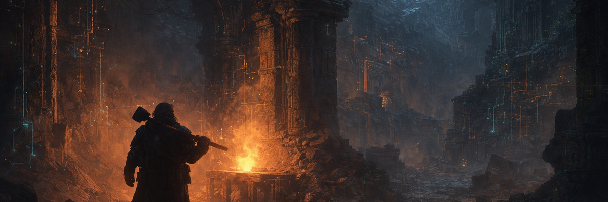

[](https://drtweak86.github.io/Mash-installer/)

# 🛠️ MASH-installer
> **Mythic Assembly & Sigil Heuristics** — A high-performance, Ratatui-powered Linux system provisioner forged in Rust.

## 📋 Project Overview
MASH-installer is a comprehensive system provisioning tool designed for rapid recovery and idempotent setup of development environments. It specializes in Raspberry Pi 4B optimization but supports aarch64 and x86_64 architectures across multiple distributions.

### 🚀 Quick Start
Run the following command to summon the installer directly from the forge:
```bash
bash <(curl -L https://raw.githubusercontent.com/drtweak86/Mash-installer/main/install.sh)
```

For detailed operating instructions and troubleshooting, see the [MANUAL.md](docs/MANUAL.md).

## 🏗️ Technical Architecture
The project is structured as a modular Rust workspace, ensuring separation of concerns between core logic, UI, and platform-specific implementations.

### 📂 Directory Structure
- `installer-core/`: The engine. Logic, models, system types, and wallpaper harvesting.
- `installer-cli/`: The gate. Contains the Ratatui TUI and CLI interface.
- `installer-drivers/`: The specialized smiths. Consolidated Arch, Debian, and Fedora drivers.
- `resources/`: Shell configurations, themes, and string localizations.
- `docs/`: Technical specifications, historical records, and the Bard's personal journal.

## ⚙️ Core Features
- **Ratatui TUI**: A 4-pane cyberpunk interface with real-time telemetry and status monitoring.
- **Idempotent Phases**: Every installation step is gated and trackable.
- **Dry-Run Mode**: Full execution simulation with detailed logging (`--dry-run`).
- **Pi 4B Optimization**: Dedicated tuning for USB 3.0 HDDs, kernel parameters, and I/O schedulers.
- **Safety First**: TLS hardening, exclusive lockfiles, and graceful signal handling (SIGINT/SIGTERM) with rollback support.

## 🛠️ Development & Quality Gates
The forge only crowns green builds. All contributions must pass the following rituals:

```bash
# Linting & Formatting
cargo fmt --all -- --check
cargo clippy --all-targets --all-features -- -D warnings

# Testing
cargo test --all --all-features

# Shell Validation
shellcheck install.sh
```

For comprehensive quality assurance details, including the CI/CD pipeline, code coverage requirements, Docker image builds, integration tests, nightly checks, and documentation validation, see [Mining Projects - Maps Explored](docs/forge-tavern/maps-explored.md).

## 📜 Documentation
- 📚 [User Manual](https://drtweak86.github.io/Mash-installer/) — Full documentation on GitHub Pages (mdBook)
- 📖 [MANUAL.md](docs/MANUAL.md) — Offline user manual
- 🍺 [Bard's BBS Profile](docs/forge-tavern/bard-bbs-profile.md) — The engineer's persona and rules of the forge.
- 🗺️ [Mining Maps](docs/forge-tavern/maps.md) — Current session work and future shafts.

## ⚖️ License
This project is licensed under the MIT License - see the [LICENSE](LICENSE) file for details.

---
**Signed,**  
*Bard, Drunken Dwarf Runesmith*
