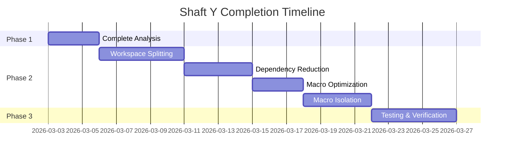
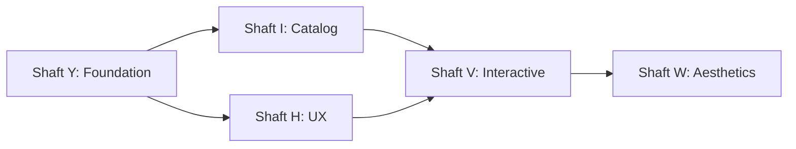

# 🗺️ ORDER OF EXPLORATION
> *"First the map, then the pickaxe."* — Bard 🍺

This document establishes the canonical order in which shafts should be explored and completed, ensuring a logical progression from foundational work to advanced features.

## 🏗️ CURRENT ACTIVE SHAFTS (Priority Order)

### 1. 🏗️ SHAFT Y: Repository Restructuring & Code Quality — PHASE 1 COMPLETE (60%)
**Status**: ⏳ PHASE 1 COMPLETE | PHASE 2 PLANNING
**Priority**: CRITICAL (foundational improvements)
**Dependencies**: None
**Next Action**: Complete Phase 1 to 100% and begin Phase 2

#### Phase 1 Completion Plan (Immediate - 1-3 days)

1. **Fix Formatting Issues**
   ```bash
   # Auto-fix all formatting issues
   cargo fmt
   
   # Verify fixes
   cargo fmt --check
   ```
   - **Expected**: Clean formatting across all crates
   - **Success**: No rustfmt errors
   - **Document**: Updated formatting guidelines

2. **Investigate Clippy on Individual Crates**
   ```bash
   # Test core crate
   cargo clippy -p installer-core -- -D warnings > docs/scratch/clippy_core.txt
   
   # Test CLI crate
   cargo clippy -p installer-cli -- -D warnings > docs/scratch/clippy_cli.txt
   
   # Test other crates
   for crate in installer-debian installer-arch installer-fedora wallpaper-downloader; do
       cargo clippy -p $crate -- -D warnings > "docs/scratch/clippy_${crate}.txt"
   done
   ```
   - **Expected**: Identify complex code patterns
   - **Success**: All crates pass clippy checks
   - **Document**: Complexity analysis report

3. **Analyze Procedural Macros**
   ```bash
   # Find derive macros
   grep -rn "#\[derive" --include="*.rs" . > docs/scratch/derive_macros.txt
   
   # Find attribute macros
   grep -rn "#\[" --include="*.rs" . | grep -i "macro" > docs/scratch/attribute_macros.txt
   
   # Find common macro usages
   grep -rn "println!\|format!\|vec!\|hash!" --include="*.rs" . > docs/scratch/common_macros.txt
   ```
   - **Expected**: Complete procedural macro catalog
   - **Success**: All macros documented
   - **Document**: Updated macro inventory

4. **Manual Code Review of Complex Areas**
   ```bash
   # Find large files (>500 lines)
   find . -name "*.rs" -exec wc -l {} + | sort -nr | head -10 > docs/scratch/large_files.txt
   
   # Review each large file
   # Document findings in code_review_notes.md
   ```
   - **Expected**: Identify complex functions and patterns
   - **Success**: Complexity documented
   - **Document**: Code review findings

#### Phase 2 Planning (Short-Term - 1-2 weeks)

1. **Complete Performance Analysis**
   ```bash
   # Baseline build time
   time cargo build --release > docs/scratch/build_time_baseline.txt
   
   # Per-crate build times
   for crate in installer-core installer-cli installer-debian installer-arch installer-fedora wallpaper-downloader; do
       echo "=== $crate ===" >> docs/scratch/build_time_per_crate.txt
       time cargo build -p $crate --release >> docs/scratch/build_time_per_crate.txt 2>&1
   done
   
   # Alternative size analysis
   du -sh target/release/* > docs/scratch/binary_sizes_simple.txt
   ```
   - **Expected**: Performance baseline established
   - **Success**: Build times measured
   - **Document**: Performance analysis report

2. **Document Procedural Macro Usage**
   ```bash
   # Create comprehensive macro catalog
   # Document each macro's purpose and usage
   # Update macro_inventory.md
   ```
   - **Expected**: Complete macro documentation
   - **Success**: All procedural macros cataloged
   - **Document**: Final macro inventory

3. **Dependency Consolidation Planning**
   ```bash
   # Create consolidation plan
   # Document version conflicts
   # Plan migration strategy
   # Update dependency_analysis.md
   ```
   - **Expected**: Clear consolidation roadmap
   - **Success**: Plan documented
   - **Document**: Dependency consolidation plan

4. **Create Remediation Plan**
   ```bash
   # Prioritize all findings
   # Create actionable items
   # Estimate effort for each
   # Document in remediation_plan.md
   ```
   - **Expected**: Prioritized action plan
   - **Success**: Clear path forward
   - **Document**: Complete remediation plan

#### Phase 3 Implementation (Long-Term - Ongoing)

1. **Establish Code Quality Metrics**
   ```bash
   # Define metrics in quality_metrics.md
   # Maximum function length: 50 lines
   # Maximum nesting depth: 3 levels
   # Cyclomatic complexity limits
   ```
   - **Expected**: Clear quality standards
   - **Success**: Metrics defined
   - **Document**: Quality metrics guide

2. **Implement CI/CD Quality Gates**
   ```bash
   # Add to .github/workflows/ci.yml
   # Required: cargo fmt --check
   # Required: cargo clippy -- -D warnings
   # Required: Build time monitoring
   ```
   - **Expected**: Automated quality enforcement
   - **Success**: CI/CD updated
   - **Document**: Updated CI pipeline

3. **Continuous Monitoring Setup**
   ```bash
   # Set up monitoring dashboard
   # Track technical debt over time
   # Regular code quality reviews
   # Dependency health monitoring
   ```
   - **Expected**: Ongoing quality tracking
   - **Success**: Monitoring in place
   - **Document**: Monitoring setup guide

4. **Documentation Improvements**
   ```bash
   # Create architectural decision records
   # Update code quality guidelines
   # Document macro usage policies
   # Improve API documentation
   ```
   - **Expected**: Comprehensive documentation
   - **Success**: Docs complete
   - **Document**: Updated documentation

### 2. 🏗️ SHAFT H: Installer Experience Overhaul — PLANNING COMPLETE
**Status**: ✅ PLANNING COMPLETE | ⏳ IMPLEMENTATION PENDING
**Priority**: HIGH (user experience improvements)
**Dependencies**: Shaft Y Phase 1 (60% complete)
**Next Action**: Begin implementation after Shaft Y Phase 1 completion

### 3. 🏗️ SHAFT I: Software Catalog & Installation Flow Overhaul — PLANNING COMPLETE
**Status**: ✅ PLANNING COMPLETE | ⏳ IMPLEMENTATION PENDING
**Priority**: HIGH (catalog restructuring)
**Dependencies**: Shaft Y Phase 1 (60% complete)
**Next Action**: Begin implementation after Shaft Y Phase 1 completion

## 📜 RECOMMENDED EXPLORATION ORDER

### Phase 1: Foundation & Quality (Current Focus)
1. **Shaft Y** - Repository Restructuring & Code Quality (ACTIVE)
   - Complete Phase 1 analysis (100%)
   - Implement workspace splitting
   - Reduce dependencies
   - Optimize macros
   - Establish quality metrics

### Phase 2: Core Value & Flow
2. **Shaft I** - Catalog & Installation Flow Overhaul
   - S-Tier software catalog implementation
   - Manual/Auto/Bard's Recommendations modes
   - Category-based menu restructuring

3. **Shaft H** - Installer Experience Overhaul
   - Font management system
   - Desktop environment support
   - Improved install flow
   - Enhanced information display

### Phase 3: Living Installations
4. **Shaft V** - The Interactive Forge
   - Dependency-first orchestration
   - Interactive authorization service
   - Post-install verification

### Phase 4: Aesthetic Mastery
5. **Shaft W** - The Aesthetic Guild
   - Intelligent preset engine
   - Clobber-safe dotfile management
   - TUI "Wardrobe" selection screen

## 🎯 STRATEGIC RATIONALE

### Immediate Focus: Shaft Y Completion

**Priority**: CRITICAL
**Reason**: Foundation for all other shafts
**Blocker**: Current 60% completion blocks progress



### Why Shaft Y First?

1. **Technical Foundation**: Clean codebase enables faster development
2. **Build Performance**: Faster builds = faster iteration
3. **Code Quality**: Fewer bugs = more reliable features
4. **Maintainability**: Easier to maintain = sustainable growth
5. **Scalability**: Better structure = easier to add features

### Then Shafts I & H Together



**Rationale**:
- Shaft I provides software organization foundation
- Shaft H enhances user experience
- Both can develop in parallel
- Shaft V builds on organized catalog + good UX
- Shaft W is the final polish layer

## 📝 EXPLORATION GUIDELINES

### Current Focus: Shaft Y Phase 1 Completion

1. **Complete Before Moving On**: Finish Phase 1 to 100%
2. **Daily Standups**: Track progress on immediate actions
3. **Document Everything**: Update analysis reports daily
4. **Quality First**: Don't sacrifice quality for speed
5. **Incremental Progress**: Small, testable changes

### General Guidelines

1. **One shaft at a time**: Focus on completing Shaft Y first
2. **Phase completion**: Mark each phase as complete in maps.md
3. **Document everything**: Update maps.md and maps-explored.md
4. **Test thoroughly**: Ensure all verification steps pass
5. **Follow the laws**: Adhere to Immutable Laws and Tavern Guidelines

## 🔮 FUTURE SHAFTS (Post Y, I, H)

After completing Shafts Y, I, and H, consider:

- **Shaft Z**: Advanced System Optimization
  - Performance tuning
  - Benchmarking
  - Auto-optimization

- **Shaft AA**: Cloud Integration
  - AWS/Azure/GCP tooling
  - Container orchestration
  - Serverless frameworks

- **Shaft AB**: AI/ML Tooling
  - Data science tools
  - Machine learning frameworks
  - GPU acceleration

## 📊 PROGRESS TRACKER

### Shaft Y: Repository Restructuring & Code Quality

```markdown
| Phase | Status | Completion | ETA |
|-------|--------|------------|-----|
| Phase 1: Analysis | ⏳ Active | 60% | 2026-03-06 |
| Phase 2: Workspace | ⏳ Pending | 0% | 2026-03-13 |
| Phase 3: Dependencies | ⏳ Pending | 0% | 2026-03-18 |
| Phase 4: Macros | ⏳ Pending | 0% | 2026-03-25 |
| Phase 5: Testing | ⏳ Pending | 0% | 2026-03-30 |
```

### Overall Roadmap

```markdown
| Shaft | Status | Priority | Blocked By |
|-------|--------|----------|------------|
| Y | ⏳ Phase 1 (60%) | CRITICAL | - |
| I | ✅ Planning | HIGH | Shaft Y |
| H | ✅ Planning | HIGH | Shaft Y |
| V | ✅ Planning | MEDIUM | Shafts I+H |
| W | ✅ Planning | MEDIUM | Shafts I+H |
```

## 🏆 EXPECTED OUTCOMES

### After Shaft Y Completion

1. **Clean Codebase**: Well-structured, maintainable code
2. **Fast Builds**: Optimized dependency structure
3. **Quality Metrics**: Established and enforced
4. **Good Documentation**: Complete and accurate
5. **Solid Foundation**: Ready for feature development

### After Shafts Y + I + H

1. **Modern Installer**: Feature-complete, user-friendly
2. **Organized Catalog**: Logical software organization
3. **Great UX**: Intuitive, informative interface
4. **Cross-Distro**: True multi-distro support
5. **Developer Productivity**: Complete toolchain setup

### Long-Term Impact

1. **User Adoption**: More accessible to all skill levels
2. **Community Growth**: Easier contribution and extension
3. **Ecosystem Expansion**: Foundation for future features
4. **Reputation**: Known for quality and reliability
5. **Maintainability**: Sustainable development velocity

## 🎯 CONCLUSION

**Current Priority**: Complete Shaft Y Phase 1 to 100%

**Immediate Actions** (1-3 days):
1. ✅ Fix formatting issues
2. ✅ Investigate clippy on individual crates
3. ✅ Analyze procedural macros
4. ✅ Manual code review

**Short-Term Actions** (1-2 weeks):
1. Complete performance analysis
2. Document procedural macro usage
3. Create dependency consolidation plan
4. Develop remediation plan

**Long-Term Actions** (Ongoing):
1. Establish code quality metrics
2. Implement CI/CD quality gates
3. Set up continuous monitoring
4. Improve documentation

**Blockers**: None - Shaft Y is the current focus

**Next Review**: 2026-03-06 (Phase 1 completion check)

"*From forge to future - one commit at a time.*" — Bard 🍺⚒️

**Last Updated**: 2026-03-03
**Next Update**: 2026-03-06 (Phase 1 completion)
**Status**: 🔥 ACTIVE - SHAFT Y PHASE 1 COMPLETION
